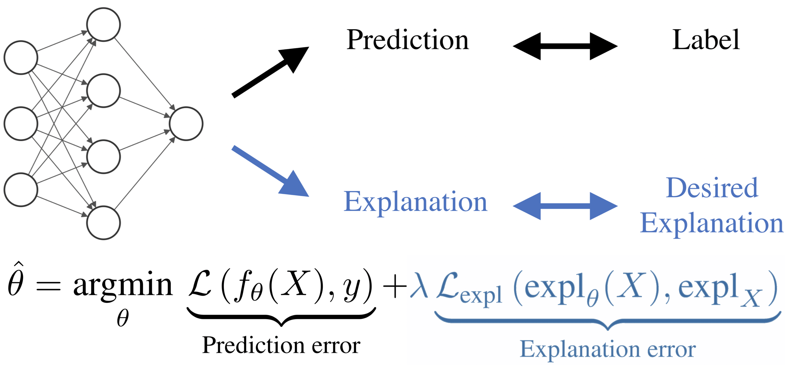
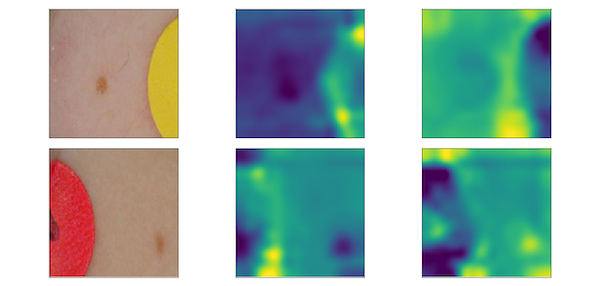

Official code for using / reproducing CDEP from the paper "[Interpretations are useful: penalizing explanations to align neural networks with prior knowledge](https://openreview.net/pdf?id=SkEqro0ctQ)". This code allows one to regularize interpretations (computed via contextual decomposition) to improve neural networks (trained in pytorch).

*Note: this repo is actively maintained. For any questions please file an issue.*



# documentation

- fully-contained data/models/code for reproducing and experimenting with CDEP
- the [src](src) folder contains the core code for running and penalizing contextual decomposition
- in addition, we run experiments on 4 datasets, each of which are located in their own folders
- see the [reproduce_figs](reproduce_figs) folder for notebooks with examples of using ACD to reproduce figures in the paper
  - try your own examples on these models with simple alterations to the notebooks
- tested with python3 and pytorch 1.0 with/without gpu 

|      ISIC skin-cancer classification      |                 ColorMNIST                 |      Fixing text gender biases      |
| :---------------------------------------: | :----------------------------------------: | :---------------------------------: |
|  |  |  |


# using CDEP on your own data

- to use CDEP on your own model, first you must be able to run CD/ACD on your model. Specifically, 3 things must be altered:
  1. the pred_ims function must be replaced by a function you write using your own trained model. This function gets predictions from a model given a batch of examples.
  2. the model must be replaced with your model
  3. the current CD implementation doesn't always work for all types of networks. If you are getting an error inside of `cd.py`, you may need to write a custom function that iterates through the layers of your network (for examples see `cd.py`)

# related work

- this work is part of an overarching project on interpretable machine learning, guided by the [PDR framework](https://arxiv.org/abs/1901.04592)
- for related work, see the [github repo](https://github.com/csinva/hierarchical-dnn-interpretations) for [acd (hierarchical interpretations)](https://openreview.net/pdf?id=SkEqro0ctQ)
- for related work, see the [github repo](https://github.com/csinva/disentangled-attribution-curves) for [disentangled attribution curves](https://arxiv.org/abs/1905.07631)


# reference

- feel free to use/share this code openly

- if you find this code useful for your research, please cite the following:

  ```c
  @article{singh2018hierarchical,
    title={Hierarchical interpretations for neural network predictions},
    author={Singh, Chandan and Murdoch, W James and Yu, Bin},
    journal={arXiv preprint arXiv:1806.05337},
    year={2018}
  }
  ```

  